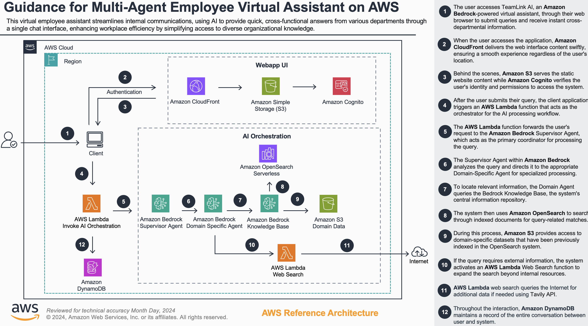

# Employee Virtual Assistant on AWS

## Table of Contents

1. [Overview](#overview)
    - [Cost](#cost)
2. [Prerequisites](#prerequisites)
    - [Operating System](#operating-system)
    - [AWS Account Requirements](#aws-account-requirements)
    - [AWS CDK Bootstrap](#aws-cdk-bootstrap)
3. [Deployment Steps](#deployment-steps)
4. [Deployment Validation](#deployment-validation)
5. [Running the Guidance](#running-the-guidance)
6. [Next Steps](#next-steps)
7. [Cleanup](#cleanup)

## Overview

The Employee Virtual Assistant is a sophisticated AI-powered assistant that helps employees find information about HR policies, benefits, payroll, IT support, and training resources. Built with Amazon Bedrock for intelligent responses and document understanding, this solution addresses the common challenge organizations face in providing employees with quick, accurate information across multiple domains.


This solution implements a serverless architecture using several AWS services:

- **Frontend**: React single-page application hosted on CloudFront
- **Backend**: AWS Lambda functions deployed via CDK
- **AI**: Amazon Bedrock
- **Authentication**: Amazon Cognito
- **Storage**: Amazon S3
- **Knowledge Base**: Amazon Bedrock Knowledge Bases
- **API Layer**: Amazon API Gateway
- **Content Delivery**: Amazon CloudFront

### Architecture



### Cost

You are responsible for the cost of the AWS services used while running this Guidance. The cost for running this Guidance with the default settings in the US East (N. Virginia) Region is approximately $1000.00 per month for processing 1,000 user interactions per day.

We recommend creating a [Budget](https://docs.aws.amazon.com/cost-management/latest/userguide/budgets-managing-costs.html) through [AWS Cost Explorer](https://aws.amazon.com/aws-cost-management/aws-cost-explorer/) to help manage costs. Prices are subject to change. For full details, refer to the pricing webpage for each AWS service used in this Guidance.

#### Sample Cost Table

The following table provides a sample cost breakdown for deploying this Guidance with the default parameters in the US East (N. Virginia) Region for one month.

| AWS service | Dimensions | Cost [USD] |
| ----------- | ------------ | ------------ |
| Amazon API Gateway | 1,000,000 REST API calls per month | $3.50/month |
| Amazon Cognito | 1,000 active users per month without advanced security feature | $0.00/month |
| AWS Lambda | 2,000,000 requests/month, 1GB memory, 500ms average duration | $10.40/month |
| Amazon S3 | 5 GB storage, 50,000 GET requests | $0.12/month |
| Amazon CloudFront | 50 GB data transfer, 1,000,000 requests | $4.50/month |
| Amazon Bedrock | Claude Sonnet model: 1,000,000 input tokens, 1,000,000 output tokens | $18.00/month |
| Amazon DynamoDB | 5 GB storage, 5 million read requests, 1 million write requests | $2.55/month |
| Amazon OpenSearch Serverless |  | Approx $1,000/month |
| AWS CloudFormation | Free for AWS Resources | $0.00/month |

## Prerequisites

### Operating System

These deployment instructions are optimized to work best on macOS, Linux, or Windows with WSL (Windows Subsystem for Linux). Deployment in another OS may require additional steps.

Required software:
- Git
- Python 3.9+ and pip
- Node.js v14+ and npm
- AWS CLI configured

### AWS Account Requirements

- An AWS Account with appropriate permissions
- Amazon Bedrock access enabled in your AWS account
- Tavily API key (optional - for web search functionality)

### AWS CDK Bootstrap

This Guidance uses AWS CDK. If you are using AWS CDK for the first time, please perform the below bootstrapping:

```bash
# Install AWS CDK globally
npm install -g aws-cdk

# Bootstrap your AWS environment for CDK
cdk bootstrap aws://ACCOUNT-NUMBER/REGION
```

Replace `ACCOUNT-NUMBER` with your AWS account ID and `REGION` with your preferred AWS region.

## Deployment Steps

1. Clone the repository:
   ```bash
   git clone Employee_Virtual_Assistant_Project.git <URL for the repo name>
   cd Employee_Virtual_Assistant_Project
   ```

2. Create and activate a Python virtual environment:
   ```bash
   python -m venv .venv
   source .venv/bin/activate  # On Windows: .venv\Scripts\activate
   ```

3. Install CDK project dependencies:
   ```bash
   cd employee_virtual_assistant_cdk
   pip install -r requirements.txt
   ```

4. Create the Lambda dependencies layer:
   ```bash
   mkdir -p layer/python
   pip install requests requests-aws4auth opensearch-py -t layer/python
   ```

5. Deploy the backend infrastructure:
   
   With Tavily API key (recommended for search functionality):
   ```bash
   python deploy.py --tavily-api-key YOUR_TAVILY_API_KEY
   ```

   Or deploy without Tavily:
   ```bash
   python deploy.py
   ```

6. Note the CloudFront URL from the deployment output. This is the access URL for your application.

## Deployment Validation

1. Open the AWS CloudFormation console and verify the status of the stack named "EmployeeAssistantStack" shows "CREATE_COMPLETE".

2. Verify the following resources have been created:
   - Amazon S3 bucket for frontend hosting
   - CloudFront distribution
   - Cognito User Pool
   - Lambda functions
   - API Gateway endpoints
   - Amazon Bedrock Knowledge Bases

3. Use the following command to verify the CloudFront distribution status:
   ```bash
   aws cloudfront list-distributions --query "DistributionList.Items[?Comment=='Employee Virtual Assistant Frontend'].DomainName" --output text
   ```

## Running the Guidance

1. Access the application through the CloudFront URL provided at the end of the deployment:
   ```
   🎉 Deployment complete! Your website is available at:
   https://<your_cloudfront>.cloudfront.net
   ```

2. Sign up for an account:
   - Click "Sign Up" and enter your email and password
   - Verify your email using the verification code sent to your inbox
   - Sign in with your credentials

3. Document upload:
   - Click the "Upload" button
   - Select a document to upload to the knowledge base
   - Once processed, the AI can use this document to answer future questions

4. Use the chat interface based on the uploaded documents:
   - Type your question about HR policies, benefits, payroll, IT support, or training in the text input area
   - Press Enter or click the send button
   - The AI will respond with relevant information from the knowledge base

Example questions you can ask:
- "What is our company's parental leave policy?"
- "How do I request time off?"
- "Where can I find information about our health benefits?"
- "How do I reset my work email password?"
- "What training courses are available for my role?"

## Next Steps

After deploying the Employee Virtual Assistant, consider these enhancements:

1. **Expand the Knowledge Base**: Add company-specific documents to make the assistant more valuable:
   - HR policy documents
   - Employee handbooks
   - IT support guides
   - Training materials

2. **Customize the UI**: Modify the frontend to match your company branding by editing the React components.

3. **Add User Personalization**: Enhance the application to provide personalized responses based on employee role, department, or location.

4. **Integrate with Existing Systems**: Connect the assistant to your HRIS, ticketing system, or other internal tools.

5. **Implement Analytics**: Add tracking to understand common questions and improve the assistant's responses over time.

## Cleanup

To remove all resources created by this Guidance, follow these steps:

1. Empty the S3 buckets created by the stack:
   ```bash
   # Find bucket names
   aws s3 ls | grep employee-assistant

   # Empty each bucket (replace BUCKET_NAME with actual bucket name)
   aws s3 rm s3://BUCKET_NAME --recursive
   ```

2. Delete the CloudFormation stack:
   ```bash
   cd employee_virtual_assistant_cdk
   cdk destroy
   ```

3. If prompted, confirm the deletion by entering 'y'.

4. Verify all resources have been deleted by checking the CloudFormation console.

## Considerations

The codebase does not address these code scan findings since this code is NOT INTENDED for Production usage. The codebase has been created with the sole intention of demonstrating multi-agent architectural patterns with the assumption that the end-user will harden the codebase to meet the security considerations as required.

| Code Scan | Cause | Explanation |
| --- | --- | --- |
| grype | Inefficient Regular Expression Complexity in nth-check | The nth-check package is a transitive dependency, and not directly referred in the application. |
| semgrep | Arbitrary-sleep Message: time.sleep() | time.sleep() is intentionally used to control the timing of retries and prevent rate limiting issues when interacting with boto3 APIs |
| semgrep | Detected subprocess function 'run' without a static string. | The subprocess call uses a fixed list of arguments with shell=False, which prevents shell injection. All variables used (stack_name, tavily_api_key, region, cdk_out_dir) are application-controlled and sanitized. Therefore, this usage is safe and not vulnerable to command injection |